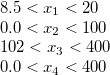

# Description

This project is an adaptation from the work of Hans Bruun Nielsen, Søren Nymand and Lophaven Jacob Søndergaard.

## Notes
**This is a implementation that relies heavily on linear algebra solvers** (least-squares solvers, Cholesky and QR 
decompositions, etc.). Therefore, it is strongly advised that your numpy library be integrated to a 
[BLAS library](http://markus-beuckelmann.de/blog/boosting-numpy-blas.html) (e.g.: Intel-MKL, OpenBLAS, ATLAS, etc.) 
in order to attain satisfactory performances of calculation.

For the sake of convenience, Anaconda handles the gritty details of how to combine numpy and those libraries natively.

## Installation

To install through PyPi Repository:

    pip install pydace

To install via conda

    conda install -c felipes21 pydace
    
## Usage

### Example with dace model

```python    
    import numpy as np
    import scipy.io as sio
    from pydace import dacefit, predictor
    import matplotlib.pyplot as plt
    
    # Load the training and validation data. (Here we are using a file from the github repo located in the folder 
    # pydace\tests with the name 'doe_final_infill_mat'
    
    mat_contents = sio.loadmat('doe_final_infill.mat')
    
    design_data = mat_contents['MV']  # design sites
    observed_data = mat_contents['CV']  # experiment results
    
    # define the hyperparameters bounds and initial estimate
    theta0 = 10 * np.ones((1, 2))
    lob = 1e-3 * np.ones(theta0.shape)
    upb = 100 * np.ones(theta0.shape)
    
    # select the training and validation data
    design_val = design_data[:99, :]
    observed_val = observed_data[:99, :]
    
    design_train = design_data[100:, :]
    observed_train = observed_data[100:, :]
    
    # build the univariate kriging models with a first order polynomial regression and a gaussian regression model
    observed_prediction = np.empty(observed_val.shape)
    for j in np.arange(design_data.shape[1]):
        krmodelPH, perfPH = dacefit(design_train, observed_train[:, j], 'poly1', 'corrgauss', theta0, lob, upb)
        krmodel.append(krmodelPH)
        perf.append(perfPH)
        
        # cross validate the data
        observed_prediction[:, [j]] = predictor(design_val, krmodelPH)[0]
    
    # plot the cross validation data
    var_labels = ['L/F', 'V/F', 'xD', 'xB', 'J', 'QR']  # labels for the observed data
    for var in np.arange(design_data.shape[1]):
        plt.figure(var + 1)
        plt.plot(observed_val[:, var], observed_prediction[:,var], 'b+')
        plt.xlabel(var_labels[var] + ' - Observed')
        plt.ylabel(var_labels[var] + ' - Kriging Prediction')
    
    plt.show
```

### Example of design of experiment data generation
It is also possible to generate design of experiment data with a variation reduction technique called Latin Hypercube
Sampling (LHS) that is already implemented in this toolbox.

Lets say we have a 4-th dimensional problem (i.e. 4 design/input variables). They are defined by the following bounds.



If we want to build a latin hypercube within these bounds we would do the following:

```python    
    import numpy as np
    from pydace.aux_functions import lhsdesign
    
    lb = np.array([8.5, 0., 102., 0.])
    ub = np.array([20., 100., 400., 400.])

    lhs = lhsdesign(53, lb, ub, include_vertices=False)
```

## Contact/Talk to me

My e-email is felipe.lima@eq.ufcg.edu.br. Feel free to contact me anytime, or just nag me if I'm being lazy.
